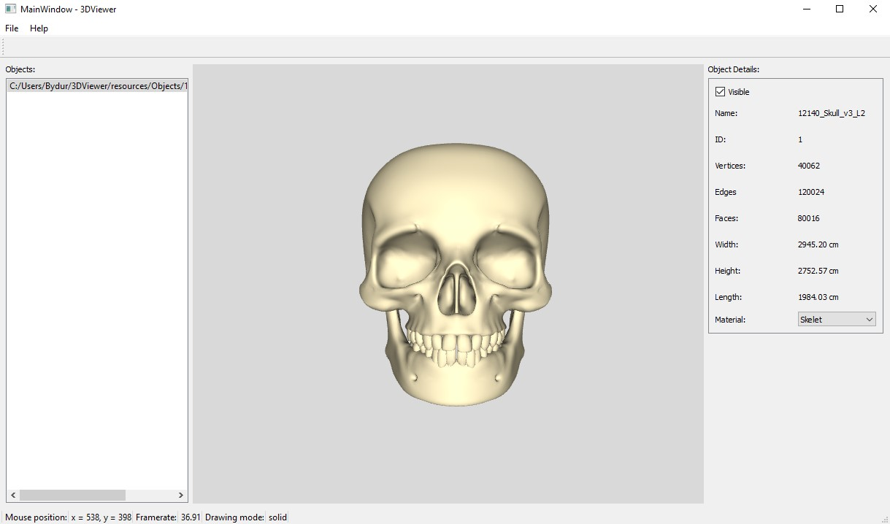

# 3D Viewer


## What does it do?

The program allows the user to upload .obj files and visualize them in a 3D scene. The user can interact with the object by moving and rotating it, as well as by adjusting the camera's position. Additionally, the program provides the ability to view details of the loaded object, such as vertices, faces, edges, and dimension parameters.
It's worth noting that the current version of the program is a MVP and will gradually expand its technology stack over time.

## Build instructions

Note: all interactions with the program were done on the Windows OS.

Go to the `./ci/win/` and run the following command:
```powershell
build_windows.bat
```
Application .exe you can find in `${projectDir}/build/Release`.

## Visual Studio Setup:

1. Navigate to the Visual Studio Installer and install "C++ Cmake tools for Windows".
2. Open Visual Studio and select from the main window "Open a local folder" and in appearing window choose `${projectDir}` directory.
3. Click on "Configurations->Manage configurations...->Add a new configurations".
4. Set a CMake toolchain file `${projectDir}/vcpkg/scripts/buildsystems/vcpkg.cmake` and CMake command arguments `-DVCPKG_TARGET_TRIPLET=x64-windows`. Press `Ctrl + S`.
5. In Solution Explorer do right click on `CMakeLists.txt` and choose "Set as Startup Item".

## How to build by own hand

1. Make sure that you have installed git and cmake.
2. Install vcpkg to the `${projectDir}` by doing these steps: `https://vcpkg.io/en/getting-started`
3. Install `Qt` and `CGAL` by running this command being in `${projectDir}/vcpkg` directory: 
```powershell
vcpkg install --triplet=x64-windows qt5 cgal
```
4. Build the executable by these cmake commands being in `${projectDir}` directory:
 ```powershell
mkdir build && cd build
cmake ..
cmake --build . --config Release
```
Application .exe you can find in `${projectDir}/build/Release`.